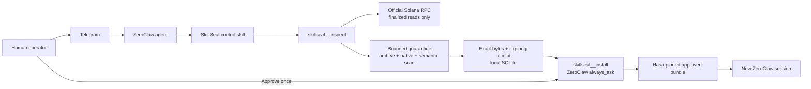

# SkillSeal

**A human-approved installation firewall for Solana-hosted ZeroClaw skills.**

SkillSeal lets an operator send a Gitlana Asset address to a real ZeroClaw agent in Telegram, inspect the exact on-chain payload without executing it, and install only an immutable, trusted, policy-compliant hash after ZeroClaw displays its native human approval control.

The core security claim is deliberately narrow:

> On-chain integrity proves which bytes were published. SkillSeal decides whether those exact bytes may cross into the local ZeroClaw skill directory.

## Why this use case exists

Gitlana can store a versioned skill archive on Solana. A frozen snapshot gives strong integrity and immutability, but neither property proves that the publisher is trusted or that the content is safe. An immutable archive can still contain prompt injection, scripts, unsafe permissions, path traversal, links, binaries, or an archive bomb.

SkillSeal turns that gap into a supervised ZeroClaw workflow:

1. The operator asks the agent to inspect a Solana Asset.
2. SkillSeal reads finalized chain metadata and verifies the declared SHA-256.
3. It scans the exact compressed bytes in quarantine and never executes them.
4. A short-lived, one-time receipt is created only for an eligible frozen snapshot.
5. The agent may request installation, but ZeroClaw keeps `skillseal__install` in `always_ask`.
6. Only a real human click can materialize the hash-pinned files into the approved bundle.
7. The receipt is consumed, and the installed skill becomes available only in a new session.

## Real end-to-end proof

The following path was completed through a dedicated Telegram bot, ZeroClaw v0.8.3, the SkillSeal MCP server, and Solana Devnet:

**Live demo:** [47.7-second Telegram showcase on YouTube](https://youtube.com/shorts/t8tzv5qQ1rU) — real channel, no slides.

```text
mutable Repo
  -> v0.1 frozen snapshot
  -> lineage-safe Repo update
  -> v0.2 frozen child snapshot
  -> finalized chain/hash/archive/native/semantic/trust inspection
  -> PASS_REQUIRES_APPROVAL receipt
  -> ZeroClaw native approval card
  -> one-time pinned installation
  -> fresh-session Telegram invocation
```

| Evidence | Public value |
| --- | --- |
| Gitlana Repo | [`gMBKWhGPtf2JSJSvyybg7wYD5aZaGbXs7PK69hVe2RK`](https://explorer.solana.com/address/gMBKWhGPtf2JSJSvyybg7wYD5aZaGbXs7PK69hVe2RK?cluster=devnet) |
| v0.1 frozen snapshot | [`DLvajTGajD2bHnvu12j44HQHXsLoYt2CSUpuBYubTeFc`](https://explorer.solana.com/address/DLvajTGajD2bHnvu12j44HQHXsLoYt2CSUpuBYubTeFc?cluster=devnet) |
| v0.2 frozen child snapshot | [`7XfnNChJq8qGK8CYeEcs7HxLD5MyeR1A8FgfPLbkTYgU`](https://explorer.solana.com/address/7XfnNChJq8qGK8CYeEcs7HxLD5MyeR1A8FgfPLbkTYgU?cluster=devnet) |
| Unsafe frozen snapshot (negative control) | [`PEqVcBkJGA3WYeVFPFsVfNPP3ug1dHKqSUHaAGPV662`](https://explorer.solana.com/address/PEqVcBkJGA3WYeVFPFsVfNPP3ug1dHKqSUHaAGPV662?cluster=devnet) |
| v0.2 payload SHA-256 | `ac205b5411c74703f15d20be023b8adf18f44b6530560cb85bce787604311b6b` |
| v0.2 verdict | `PASS_REQUIRES_APPROVAL` |
| Installed verdict | `INSTALLED_PINNED`, receipt `CONSUMED`, payload not executed |
| Fresh-session result | `approval=HUMAN`, `payload=PINNED`, `execution=READ_ONLY` |
| Local verification | `37/37` deterministic tests passing |

Final chain, approval, installation, and fresh-session evidence is consolidated in [Verification](docs/VERIFICATION.md).

## Architecture



The model cannot approve its own tool call. Chat text saying “approved” is not approval; the native out-of-band ZeroClaw control must be clicked.

See [Architecture](docs/ARCHITECTURE.md) and [Threat model](docs/THREAT-MODEL.md) for the trust boundaries and failure modes.

## ZeroClaw features used

- A real Telegram channel, not a scripted chat mock.
- A control Skill that constrains how the agent interprets inspection results.
- A local stdio MCP server with read-only `probe`, `inspect`, and `status` tools.
- A non-idempotent local-write `install` tool held in a supervised risk profile.
- `always_ask` for every installation; it is never in `auto_approve`.
- A dedicated approved Skill Bundle, loaded only after a fresh session.

## Custody and side effects

Runtime Solana custody is **T0 Read**:

- SkillSeal reads public Solana RPC data at finalized commitment.
- It does not accept, load, or request a wallet, seed phrase, or private key.
- It does not sign transactions, move tokens, or write to Solana.
- Reproducing the inspection of the public v0.2 snapshot requires no SOL.

Approved installation is a disclosed **local filesystem side effect outside the Solana custody ladder**. It is restricted to the dedicated bundle, uses the exact persisted payload, writes atomically with private modes, does not execute the content, and requires a human approval click. API results report official custody `T0_READ` plus `localEffect=HUMAN_APPROVED_SKILL_BUNDLE_WRITE` so this local action cannot be confused with the bounty's T1 Build tier.

The Devnet publisher key used to author the public demo snapshots is not part of the runtime, is excluded from version control, and is not required to reproduce inspection or installation.

## Fail-closed controls

- Finalized Solana reads and Metaplex/Gitlana owner checks.
- Exact compressed-length and SHA-256 verification.
- Frozen-snapshot requirement; mutable Repo heads are not installable.
- Local trusted-publisher allowlist; integrity is not treated as identity.
- In-memory gzip/ustar validation with path, link, entry-count, and expansion limits.
- ZeroClaw native skill audit over the exact quarantined bytes.
- Deterministic checks for scripts, binaries, permissions, obfuscation, prompt injection, and secret requests.
- Receipt binding to cluster, Asset, publisher, frozen state, SHA-256, and persisted bytes.
- Receipt expiry, atomic consumption, replay rejection, and tamper detection.
- No caller-selected destination, path, Asset override, or hash override during install.

## Quick verification

Requirements: Node.js 20+, npm, Git, and `tar`. The bootstrap command downloads only a pinned official ZeroClaw release and a pinned Gitlana commit, then verifies them before use.

```bash
npm ci
npm run bootstrap:tools
npm run check
npm run release:candidate
```

`npm run release:devnet` is an offline dry-run by default. It cannot read a publisher key or write to Devnet unless multiple explicit execution interlocks are supplied. It never supports Mainnet.

For a real ZeroClaw inspection, build the project, adapt [the example configuration](config/zeroclaw.example.toml) with local absolute paths, configure secrets through ZeroClaw rather than tracked files, and inspect the public v0.2 Devnet Asset above. Follow [Reproduction guide](docs/REPRODUCE.md).

## MCP tools

| Tool | Side effect | Purpose |
| --- | --- | --- |
| `skillseal__probe` | None | Confirm the ZeroClaw-to-MCP integration. |
| `skillseal__inspect` | Finalized RPC read + local evidence record | Verify and scan one exact Gitlana Asset; never executes or installs it. |
| `skillseal__status` | None | Read a bounded receipt state without revealing local paths or payload bytes. |
| `skillseal__install` | Human-approved local write | Consume one eligible receipt and atomically materialize its exact pinned payload. |

## Repository map

```text
src/                         MCP server and enforcement pipeline
skills/skillseal/            ZeroClaw control Skill
policies/default.toml        auditable mirror of the compiled fail-closed policy
config/zeroclaw.example.toml supervised ZeroClaw configuration fragment
scripts/                     pinned tool bootstrap and Devnet-only release tooling
fixtures/                    safe, hostile, and competition test payloads
test/                        deterministic security and integration tests
docs/                        architecture, threat model, reproduction, and live evidence
```

## Reproducibility and limitations

The deterministic test suite covers archive ambiguity, traversal and links, hash mismatch, quarantine auditing, prompt injection, forbidden scripts, trusted publishers, receipt expiry/replay/tamper, atomic installation, and Devnet release-plan interlocks.

SkillSeal is a policy firewall, not a proof that a Skill is harmless. Semantic scanning can miss novel attacks, trusted publishers can be compromised, and public RPC availability is external. The result is therefore `PASS_REQUIRES_APPROVAL`, never “safe.” Operators must review findings and keep `install` behind human approval. See [Threat model](docs/THREAT-MODEL.md).

## Documents

- [Showcase one-pager](docs/SHOWCASE.md)
- [Architecture](docs/ARCHITECTURE.md)
- [Threat model](docs/THREAT-MODEL.md)
- [Reproduction guide](docs/REPRODUCE.md)
- [Final verification evidence](docs/VERIFICATION.md)

## License

Apache-2.0. See [LICENSE](LICENSE).
