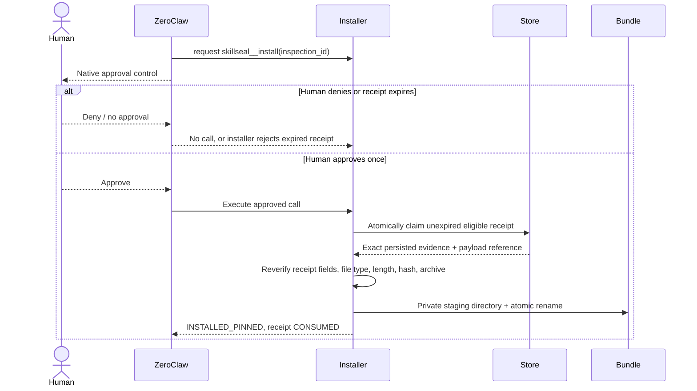
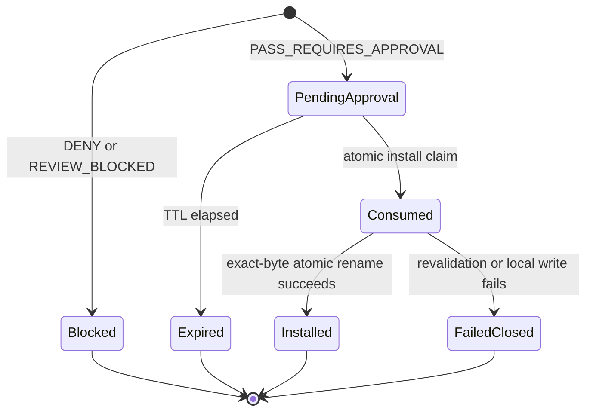

# SkillSeal architecture

## Goal

SkillSeal mediates one security-sensitive transition: moving a Gitlana skill archive from public Solana data into a ZeroClaw-approved local Skill Bundle.

The inspector is read-only with respect to Solana. The installer is a separate local-write capability and cannot run without a fresh eligible receipt plus ZeroClaw's native human approval gate.

## Components

| Component | Responsibility | Trust level |
| --- | --- | --- |
| Telegram | Human-facing request and approval surface | Untrusted chat content; approval UI is trusted only when rendered by ZeroClaw |
| ZeroClaw agent | Orchestrates the workflow and explains findings | Model output is not authorization |
| SkillSeal control Skill | Constrains tool ordering and interpretation | Local reviewed policy text |
| `skillseal__inspect` | Reads, verifies, quarantines, scans, and records | T0 Solana read; local evidence write only |
| Official Solana RPC | Returns finalized account state | External availability and correctness dependency |
| Archive preflight | Parses bounded gzip/ustar without extraction | Deterministic local enforcement |
| ZeroClaw native audit | Audits quarantined skill bytes | Defense in depth |
| Semantic policy | Detects forbidden content and declared capabilities | Deterministic local enforcement |
| Trust policy | Matches Asset owner against a local allowlist | Operator-configured trust decision |
| Inspection store | Binds the exact bytes to a short-lived one-time receipt | Local SQLite + private evidence files |
| `skillseal__install` | Revalidates and atomically materializes pinned files | Disclosed local side effect outside Solana custody; always human-approved |
| Approved bundle | Holds installed hash-named directories | Loaded only by a new ZeroClaw session |

## Inspection data flow

```mermaid
sequenceDiagram
    actor Human
    participant Telegram
    participant ZeroClaw
    participant SkillSeal
    participant Solana
    participant Quarantine
    participant Store

    Human->>Telegram: Inspect cluster + Asset address
    Telegram->>ZeroClaw: Real channel message
    ZeroClaw->>SkillSeal: skillseal__inspect(cluster, asset)
    SkillSeal->>Solana: getAccountInfo(finalized)
    Solana-->>SkillSeal: metadata + compressed payload
    SkillSeal->>SkillSeal: verify program owner, Asset owner, length, SHA-256, freeze state
    SkillSeal->>Quarantine: bounded archive preflight
    SkillSeal->>Quarantine: ZeroClaw native audit on exact bytes
    SkillSeal->>SkillSeal: semantic + trust policy
    SkillSeal->>Store: persist exact compressed bytes + structured verdict
    Store-->>SkillSeal: expiring inspection_id
    SkillSeal-->>ZeroClaw: PASS_REQUIRES_APPROVAL / REVIEW_BLOCKED / DENY
    ZeroClaw-->>Telegram: Explain evidence; do not install automatically
```

No archive entry is executed during inspection. Archive paths and entry types must pass preflight before the exact bytes are materialized into an isolated audit directory.

## Installation data flow



The installer accepts only `inspection_id`. It does not accept a caller-selected Asset, hash, payload, URL, command, or destination. This prevents the model from changing the approved object between inspection and installation.

## Receipt state machine



A post-claim failure deliberately leaves the receipt consumed. The operator must inspect again; SkillSeal prefers a safe false negative over replaying an uncertain write.

## Version lineage

The demo publisher uses a mutable Gitlana Repo as the version pointer and creates immutable release snapshots:

```text
Repo gMBK...2RK
  head -> v0.2 snapshot 7Xfn...YgU
             parentSnapshot -> v0.1 snapshot DLva...eFc
```

The publisher is an authoring tool only. The production inspection/install path does not load its private key and cannot update this lineage.

## Security invariants

1. A hash match is necessary but never sufficient for installation.
2. A mutable Asset is never installable.
3. An unknown publisher is never installable.
4. `DENY` and `REVIEW_BLOCKED` are never installable.
5. Only the exact persisted bytes bound to an unexpired receipt may be installed.
6. The model cannot convert chat text into approval.
7. Installation does not execute the installed Skill.
8. An installed Skill is not loaded into the current session.
9. Solana runtime access remains read-only and wallet-free.
